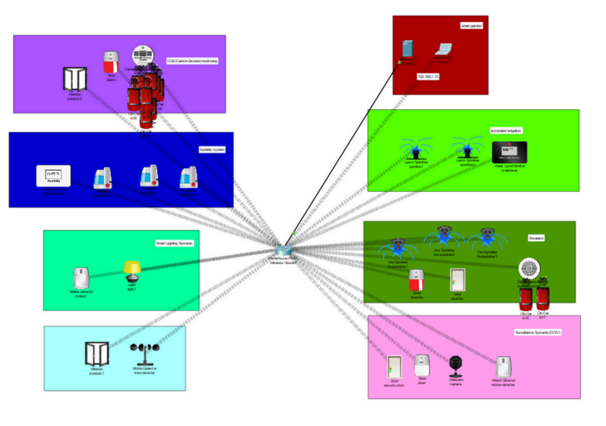
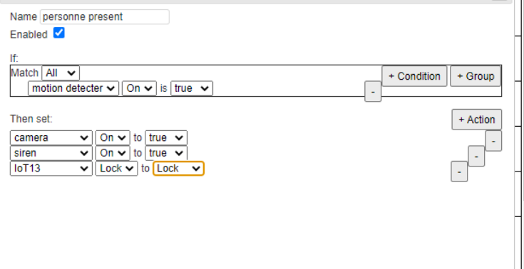
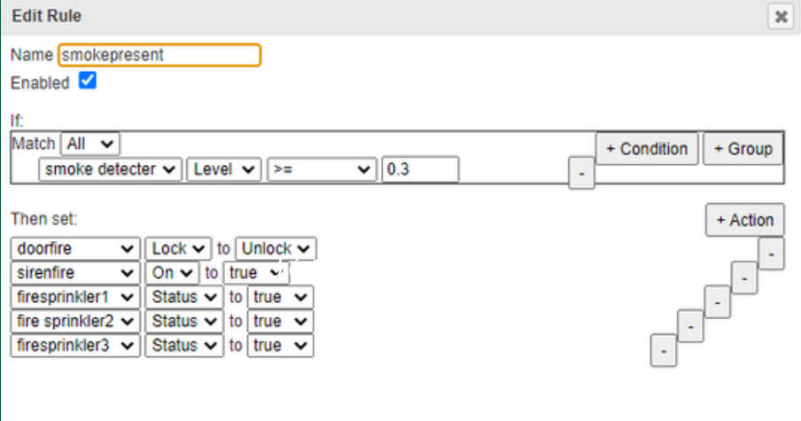

# IoT Greenhouse — Smart Greenhouse Project

**Short description**  
This project demonstrates a smart greenhouse using IoT technology. By using sensors and actuators, the system automates environmental control (temperature, humidity, light intensity, irrigation) to keep optimal growth conditions for plants. The simulation was developed using Cisco Packet Tracer (simulation), and data analysis and automation logic are described in the project report.

---

## Project Goal

Demonstrate the potential of IoT in agriculture and contribute to more sustainable and efficient farming by:

- Monitoring environmental variables (temp, humidity, light, CO₂, water level).
- Automatically actuating systems (irrigation, LED lighting, ventilation, humidifiers) based on sensor readings and rules.
- Simulating the architecture and control logic in Packet Tracer.
- Providing documentation and diagrams for replication.

---

## Overview / Introduction

This smart greenhouse project uses a set of sensors to gather environmental data and actuators to react automatically. The system architecture is wireless (Wi-Fi), giving flexibility for sensor/actuator placement and easy configuration via a central control server.

Core capabilities:

- Real-time visualization of sensor data.
- Configurable thresholds and scheduled actions (e.g., watering cycles).
- Automation scenarios to trigger actuators based on rules.
- Centralized monitoring and control from a laptop (supervision interface).

---

## Main Components

### Sensors

| Sensor                        | Purpose                                                   |
| ----------------------------- | --------------------------------------------------------- |
| Temperature & Humidity sensor | Measures ambient temperature and humidity                 |
| Light (luminosity) sensor     | Measures light intensity                                  |
| Motion sensor                 | Detects movement (for alarms or video recording triggers) |
| CO₂ sensor                    | Measures carbon dioxide concentration                     |
| Water level sensor            | Monitors water level in the reservoir                     |

### Actuators

| Actuator                    | Purpose                                  |
| --------------------------- | ---------------------------------------- |
| Automatic irrigation system | Controls watering                        |
| LED lighting                | Adjusts intensity and spectrum           |
| Fans (ventilation)          | Ensures air circulation                  |
| Humidifiers                 | Increase greenhouse humidity when needed |
| Connected locks             | Controlled access to greenhouse          |
| Surveillance cameras        | Monitor interior conditions visually     |
| Alarm sirens                | Trigger alarms in emergency situations   |

---

## Network Infrastructure & Architecture

### Global architecture

- Wireless (Wi-Fi) network connecting sensors and actuators to a router.
- A Packet Tracer virtual server hosts the greenhouse control software (data collection, processing, rule engine).
- A laptop acts as the main supervision and configuration interface.

### Devices used in simulation

- Virtual domestic router (Wi-Fi hotspot) — provides DHCP and Internet connectivity.
- Packet Tracer virtual server — central control, data logging, and rule processing.
- Laptop — user interface for monitoring, configuring thresholds, scheduling, and diagnostics.

### IP addressing (example)

- Router (gateway): `192.168.1.1`
- IoT Server: `192.168.1.10`
- IoT devices: assigned dynamically via DHCP from the router (simplifies device addition/removal)

DHCP is used to automatically assign IP addresses, subnet masks, and gateways to IoT devices. This simplifies deployment and maintenance.

---

## Network Configuration Notes (how it was set up in Packet Tracer)

- Router configured as DHCP server (address pool for IoT devices).
- IoT Server assigned static IP `192.168.1.10` and configured to receive/aggregate sensor data.
- Devices were placed in Packet Tracer and configured to connect to the Wi-Fi SSID provided by the router.
- Rules (example):
  - If temperature > X°C and humidity < Y% → activate humidifier and ventilation.
  - If water level < Z% → trigger reservoir refill + alert.
  - If motion detected during closed hours → trigger alarm and start recording.

_(If the Packet Tracer `.pkt` file is missing, see “Recreate the simulation” below.)_

---

## Screenshots

                                LAYOUT:

---

4. Programming and Automation:

Securing an area using motion sensors and alarms

o strengthen the security of our greenhouse, we implemented a surveillance system. When a motion sensor detects an intrusion, an alarm siren is triggered and a surveillance camera is activated to record the incident. In addition, the greenhouse doors are automatically locked to prevent any unauthorized access.

---

To prevent fire risks, we integrated a smoke detector into our security system. If the detected smoke level exceeds the alert threshold of 3, an audible alarm is triggered to warn the occupants. In addition, the greenhouse doors and windows automatically open to allow rapid ventilation, and automatic water-based extinguishing systems are activated to control the flames.
